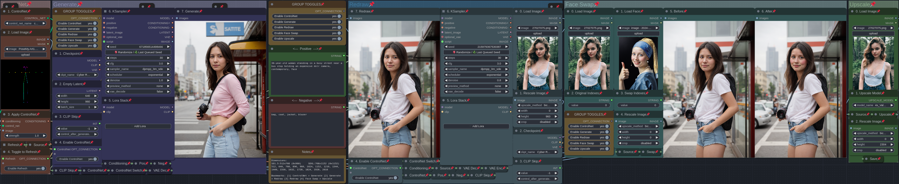
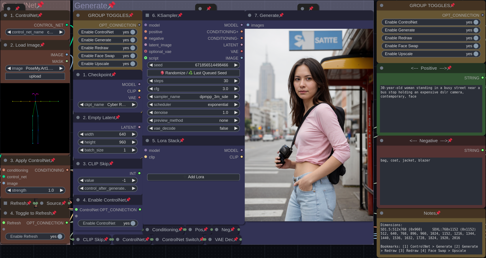
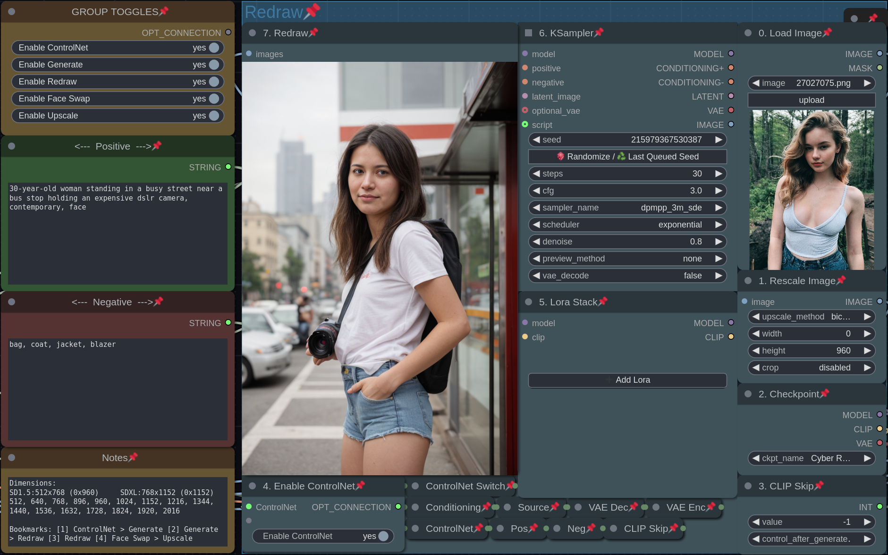
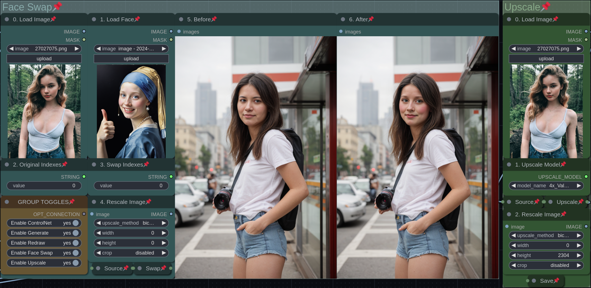

# 
### A compact and efficient toggle-based ComfyUI workflow by Luckytime

# Features

- Control Net
- Text to image
- Image to image
- Face swap
- Upscale
- No overlapping nodes
- No wasted space
- SD models only

# Dependencies

### 
### 
### 
### 

# Overview

The workflow is a pipeline of 5 groups that moves from left to right. It starts with conditioning in the 'ControlNet' group, creates an image from an empty latent in the 'Generate' group, reprocesses the image in the 'Redraw' group, fixes the face in the 'Face Swap' group, and finally upscales and saves the image in the 'Upscale' group. Any combination of the 5 groups may be used without errors. If the last three groups are used independently, a local image can be uploaded as a starting point.

# Toggles

There are 3 'Group Toggle' nodes included in the workflow so they are always within reach. Switching off the groups lets you pause after each step and decide whether an image is worth refining. If you want to send an image to the next group, the seed from any previous KSampler should be frozen by clicking 'Last Queued Seed'.

# Groups

## ControlNet

This group lets you use a ControlNet model and a preprocessed (helper) image to guide the creation of an image in the 'Generate' or 'Redraw' groups. The refresh toggle helps overcome a known bug where changing the ControlNet options does not refresh the workflow and allow you to create a new image.

### Workflow:

1. Load a ControlNet model
2. Load preprocessed image
3. Choose ControlNet strength
4. Toggle to refresh the workflow

## Generate

This group lets you create a new image from an empty latent (AKA text2img). The positive & negative prompts are shared by the 'Generate' and 'Redraw' groups.

### Workflow:

0. Write postive/negative prompts
1. Load a checkpoint
2. Choose image size
3. Choose CLIP skip
4. Toggle ControlNet
5. Load Loras
6. Choose KSampler settings
7. Preview/Save the image

## Redraw

This group lets you create variations using an image as a starting point (AKA img2img) (AKA Hires Fix). It takes the decoded image from 'Generate' and upscales, re-encodes, and redraws it with a second KSampler. If used alone, it redraws the loaded image from step 0. The positive & negative prompts are shared by the 'Generate' and 'Redraw' groups.

### Workflow:

0. Load an image
1. Choose rescale size
2. Load a checkpoint
3. Choose CLIP skip
4. Toggle ControlNet
5. Load Loras
6. Choose KSampler settings
7. Preview/Save the image

## Face Swap

This group lets you replace the face in an image with a face from a loaded image. You can choose the face indexes to be swapped if there is more than one person (ex: "2,3" -> "0,4"). If used alone, it face-swaps the loaded image from step 0. The image can be rescaled to ensure the face swap is effective. **Note: if you are getting a black box for an output, open "ComfyUI/custom_nodes/comfyui-reactor/scripts/reactor_sfw.py" in a text editor, and change 'True' on the last line to 'False'.**

### Workflow:

0. Load an image
1. Load a face
2. Choose original face indexes
3. Choose swap face indexes
4. Choose original image rescale size
5. Preview/Save the original image
6. Preview/Save the swapped image

## Upscale

This group lets you upscale an image using an upscale model, rescale the image down to save drive space, and save the image to your ComfyUI output folder. If used alone, it upscales the loaded image from step 0.

### Workflow:

0. Load an image
1. Load an upscale model
2. Choose rescale size

# Shortcuts
The 1-4 number keys are shortcuts for useful camera views. You can adjust the bookmark nodes to suit your display.
