

# 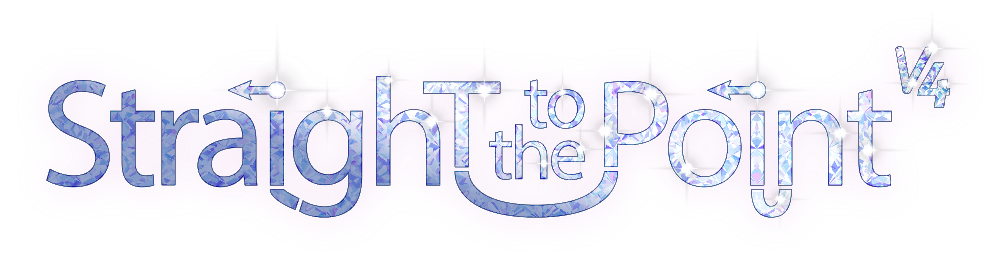
### The most straightforward all-in-one ComfyUI image workflow in the open-source space!
###### Created by Luckytime

This 11-in-1 ComfyUI workflow includes text-to-image, image-to-image, background removal, compositing, cropping, outpainting, inpainting, face swap, automatic detailer, upscaling, ultimate sd upscale, VRAM management, memory slots, and infinite looping. It uses checkpoints or single/dual clip models.

**Video Demo:** https://youtube.com/watch?v=bBtjz0jy_gQ 
**CivitAI Repo:** https://civitai.com/models/812560/straight-to-the-point 

# The Dependencies

Being an all-in-one, there are many dependencies, but I tried my best to use native nodes whenever possible, and only utilized popular/trusted custom nodes for the rest.

🔗 https://github.com/comfyanonymous/ComfyUI ➡️ ComfyUI 
🔗 https://github.com/Fannovel16/comfyui_controlnet_aux ➡️ ControlNet Preprocessors 
🔗 https://github.com/ltdrdata/ComfyUI-Impact-Pack ➡️ Impact Pack 
🔗 https://github.com/ltdrdata/ComfyUI-Impact-Subpack ➡️ Impact Subpack 
🔗 https://github.com/lquesada/ComfyUI-Inpaint-CropAndStitch ➡️ Inpaint Crop & Stitch 
🔗 https://github.com/john-mnz/ComfyUI-Inspyrenet-Rembg ➡️ Inspyrenet Rembg 
🔗 https://github.com/cubiq/ComfyUI_IPAdapter_plus ➡️ IPAdapter Plus 
🔗 https://github.com/Gourieff/ComfyUI-ReActor ➡️ ReActor 
🔗 https://github.com/rgthree/rgthree-comfy ➡️ rgthree 
🔗 https://github.com/ssitu/ComfyUI_UltimateSDUpscale ➡️ Ultimate SD Upscale 

# The Overview

### Flow

The workflow is a pipeline of 6 distinct toggleable groups. It starts by generating an image, then refines the background, inpaints details, auto-corrects features, and finishes by upscaling. The output of the first active group is automatically sent to the next, left-to-right, and any combination of the 6 groups can be used.

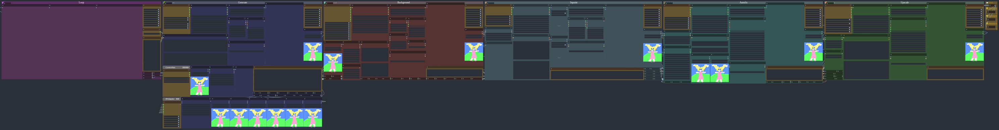

### VRAM Management

If every group is ran simultaneously, there is a high chance of depleting VRAM and getting an 'Allocation on device' error. Thus, successive groups can be toggled on following the completion of previous ones while the seed from each group can be fixed to retain the generation at each step. This flattens the load on VRAM by allowing you to load models only when they are used.

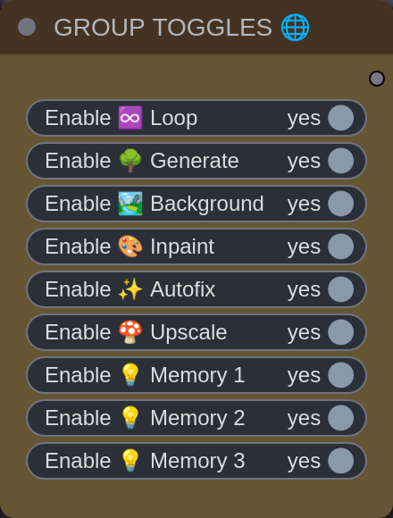
###### The group toggles are global and let you switch off groups from anywhere. 

### Memory Slots

Activate memory groups 1, 2, or 3 and run the workflow to send the last output to the corresponding memory slots. The memory groups will continuously send an output with each queue, so be careful not to overwrite images in the slots.

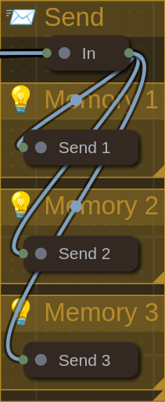

### Looping

Looping is achieved by activating the loop group + any other group. The loop group will override all other inputs and send its image to the next active group.

### Bookmarks
The 0-6 keys are shortcuts for useful camera views. You can adjust the bookmark nodes to suit your display by maximizing them and entering your desired zoom-level.

# The Groups

## Loop

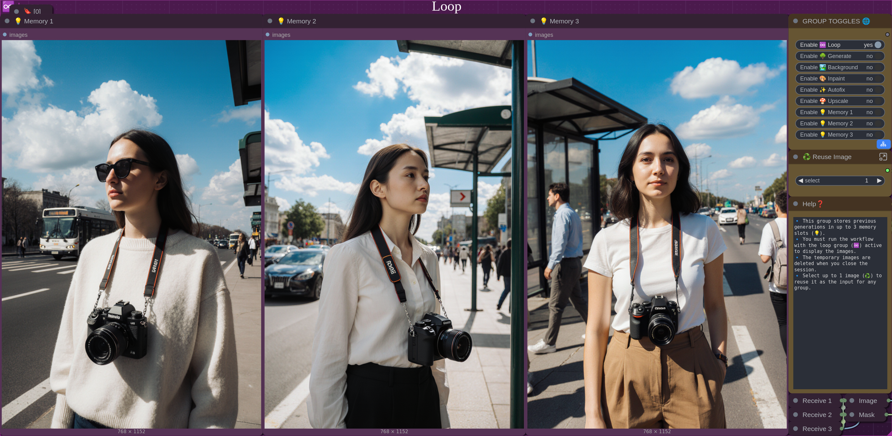

This group lets you store and reuse up to 3 saved images. You must activate this group and run the workflow so the preview nodes will display the images (this is a necessary step). To reuse an image, select the number of the image you want and run the workflow again. The loop group will override all other inputs and send its image to the next active group. Images in the loop group will be stored for the duration of the ComfyUI session, then deleted.

## Generate

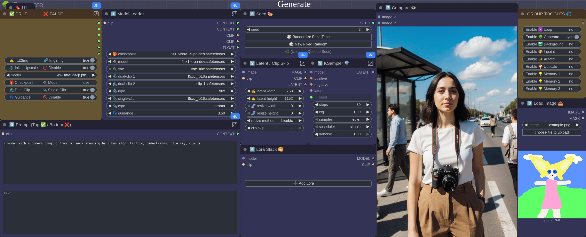

This group lets you create a new image from a beige latent (text2img) or a predefined latent (img2img). If the loaded image is small, you can upscale it with a model before step 2 (this keeps the latent sharp, rather than upscaling the image linearly). 

0️⃣ Load an image 
1️⃣ Choose model settings 
2️⃣ Choose the latent size & clip skip 
3️⃣ Enter text prompts 
4️⃣ Load LoRAs 
5️⃣ Choose KSampler settings 
6️⃣ Choose seed 
7️⃣ Compare/save the image 

### ControlNet (Stable Diffusion Only)

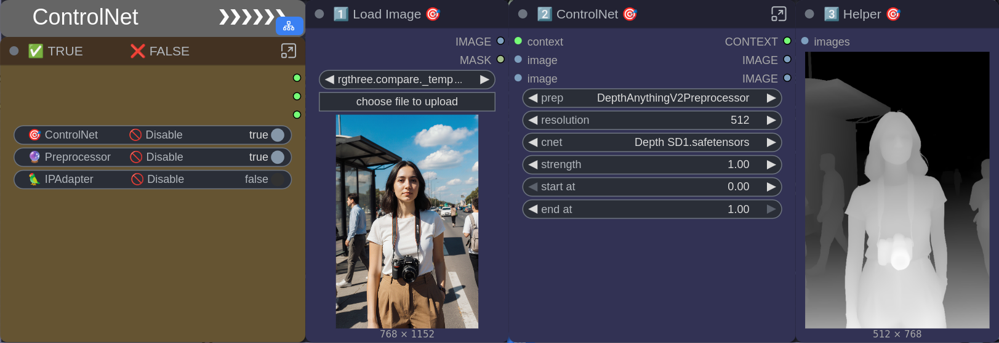

This sub-group lets you condition the model in the 'Generate' group with a ControlNet. The preprocessor extracts information from the loaded image and creates a helper, which is used for conditioning. Toggle off the preprocessor if you want to upload your own helper.

1️⃣ Load an image 
2️⃣ Choose a preprocessor & ControlNet settings 
3️⃣ Preview/save the helper 

### IPAdapter (Stable Diffusion Only)

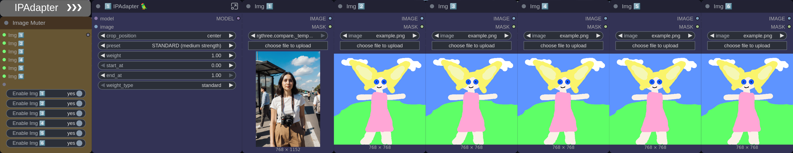

This sub-group lets you modify the model in the 'Generate' group with an IPAdapter. Up to 6 images can be toggled on to create a batch, which is used to modify the output, similar to adjusting a model with a LoRA. At least 1 image must be on and the first image in the batch will set the target resolution for the rest.

1️⃣ Choose IPAdapter settings and load an image 
2️⃣-6️⃣ Load additional images 

## Background

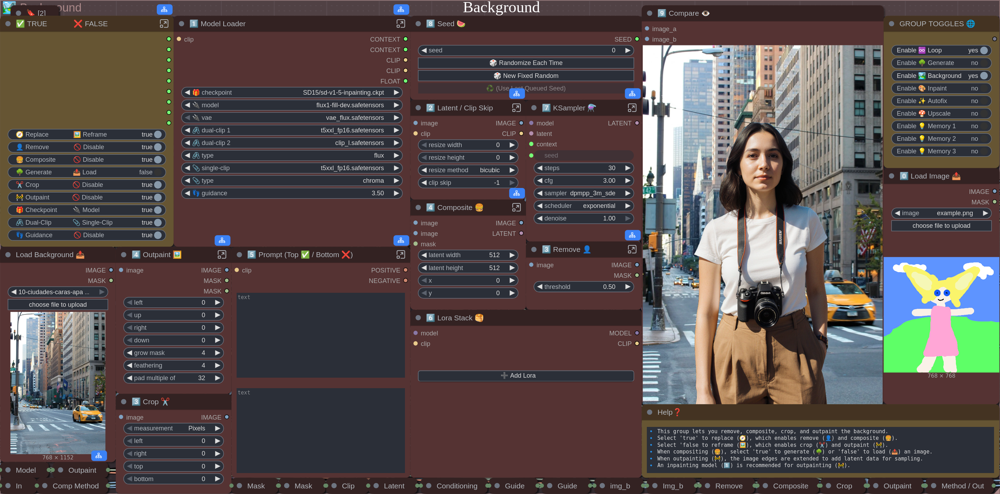

This group lets you replace the background or modify the perimeter. Choose 'Replace' if you want to remove the background and/or composite a different one. If you choose to composite, you may upload your own background or generate a completely new one. Choose 'Reframe' if you want to crop the image and/or outpaint. Note: only the whole image can be used as context when outpainting. An inpainting model is recommended for outpainting.

0️⃣ Load an image 
1️⃣ Choose model settings 
2️⃣ Choose the latent size & clip skip 
3️⃣ Choose the removal threshold or crop settings 
4️⃣ Choose the composite or outpaint settings 
5️⃣ Enter text prompts 
6️⃣ Load LoRAs 
7️⃣ Choose KSampler settings 
8️⃣ Choose seed 
9️⃣ Compare/save the image 

## Inpaint

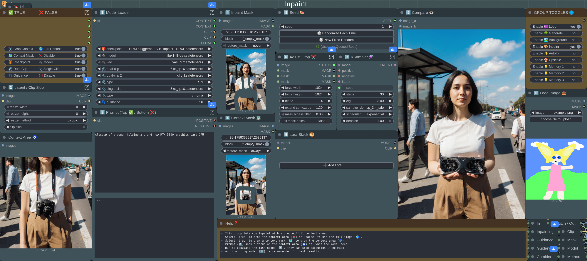

This group lets you perform inpainting. You can use either the full image as context, or only part of the image, which is easier on your gpu. You must run the workflow to load the image into the mask nodes, then draw your masks. The mask nodes can block the workflow if no mask is detected. The context mask defines the borders of your desired context area. Your prompt should describe what is in the context area, not just the masked area. An inpainting checkpoint is recommended for best results.

0️⃣ Load an image 
1️⃣ Choose model settings 
2️⃣ Choose the latent size & clip skip 
3️⃣ Enter text prompts 
4️⃣ Draw the inpaint/context masks 
5️⃣ Load LoRAs 
6️⃣ Choose the crop settings 
7️⃣ Choose KSampler settings 
8️⃣ Choose seed 
9️⃣ Compare/save the image 

## Autofix

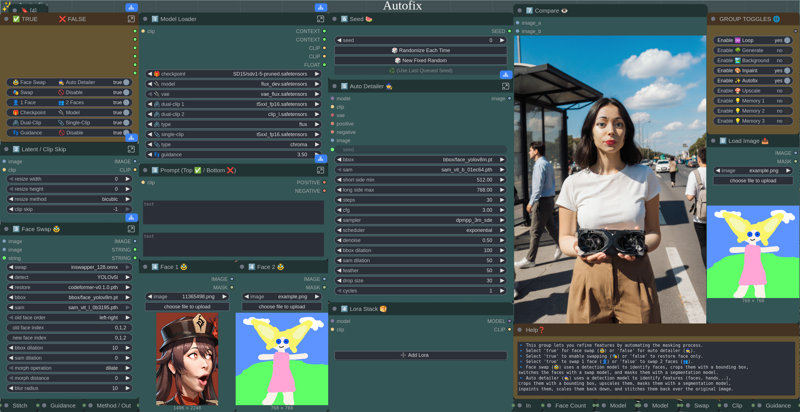

This group lets you automate detailing using various detection/segmentation/swap models. Face swapping includes face restoration, so you can disable it to just get the restoration effect. You can load up to 2 face images, which are stitched together left-to-right. Auto detailer is basically inpainting with an automatic mask. You can use a low denoise (0.2-0.3) to maintain similarity. Note: if you are getting black images when swapping, open **"ComfyUI/custom_nodes/comfyui-reactor/scripts/reactor_sfw.py"** in a text editor, and change 'True' to 'False'.

0️⃣ Load an image 
1️⃣ Choose model settings 
2️⃣ Choose the latent size & clip skip 
3️⃣ Choose face swap settings or enter text prompts 
4️⃣ Load face images or load LoRAs 
5️⃣ Choose auto detailer settings 
6️⃣ Choose seed 
7️⃣ Compare/save the image 

## Upscale

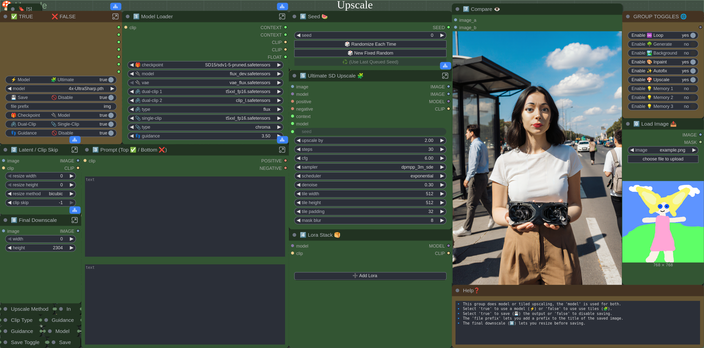

This group lets you upscale with a model or Ultimate SD Upscale (tiled upscaling). Select the upscale model for both functions in the options node. Ultimate SD Upscale splits the image into a grid of uniform tiles with some overlap, upscales them independently, then stitches them back together. If the denoise is above 0.3, the stitch seams may be too obvious. After upscaling, the image can be downscaled to reduce the file size, saving can be disabled for quality assurance, and the file prefix can be entered in the options node.

0️⃣ Load an image 
1️⃣ Choose model settings 
2️⃣ Choose the latent size & clip skip 
3️⃣ Enter text prompts 
4️⃣ Load LoRAs 
5️⃣ Choose Ultimate SD Upscale settings 
6️⃣ Choose seed 
7️⃣ Compare/save the image 
8️⃣ Choose downscale settings 

# The Extras

## Specialized Workflows

Same exact groups from the main workflow split up into individual .json files.

## Exploded Workflows

Same as the specialized workflows, but all the nodes are maximized, spread out, and reordered.

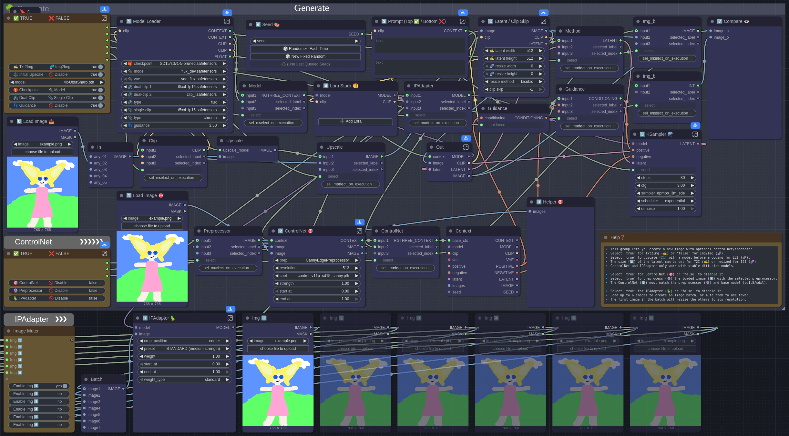

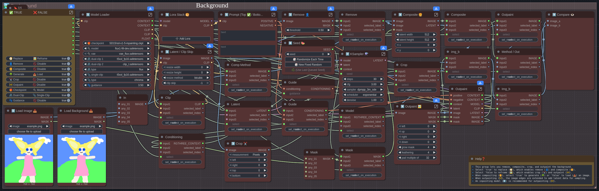

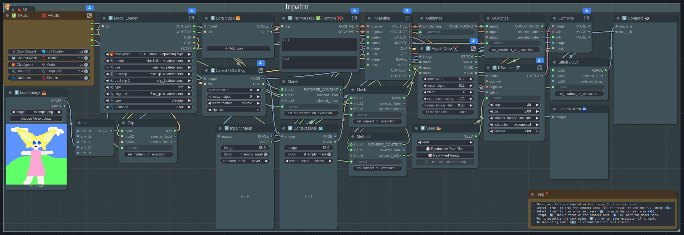

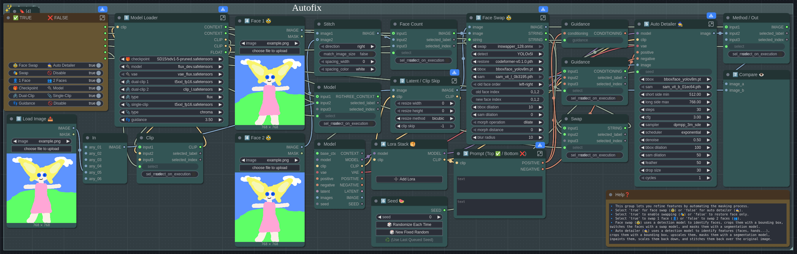

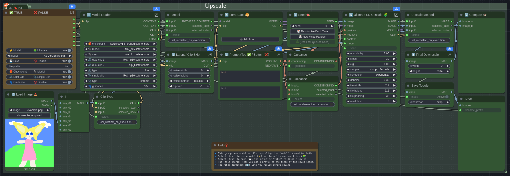

## Template Workflows

Basic workflows which demonstrate a unique function used in the main workflow.

### Loop

Loops the output image to the beginning, letting you to reuse it as many times as you want. Choose an existing image in the receiver to get started and toggle the muter to enable or disable the sender. Requires Impact Pack.

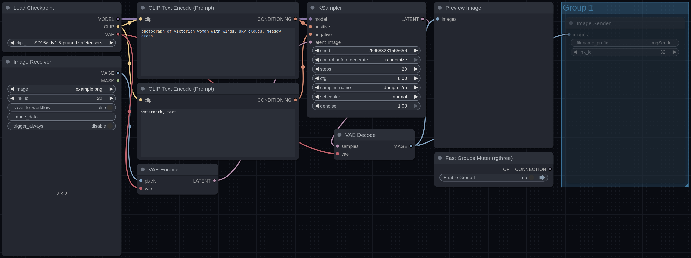

### Pause
Uses 2 KSamplers, but allows you to pause and unload the first model before continuing. The latent from the first group is automatically sent to the second group, and if the second group is toggled off, the workflow is effectively paused at that step. If the first group is toggled off, the second group gets its input from an empty latent. Requires rgthree. 

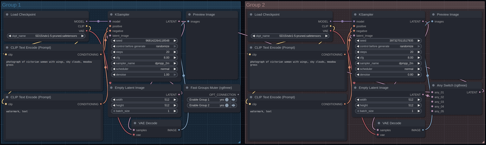

### Switch

Switches between two outputs. The 'Switch (Any)' node is controlled by the Boolean, which is converted into a '1' or '2' by the 'Power Puter'. It outputs either the decoded image or the loaded image. Requires Impact Pack, and rgthree.

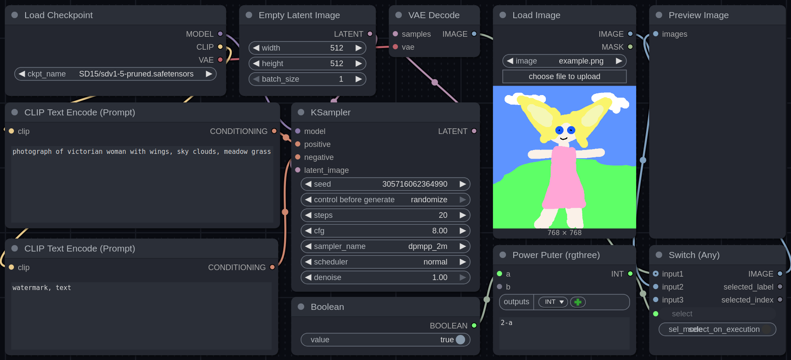

# The Changelog

### Version 1
- Added Generate group
- Added Redraw group
- Added Face Swap group
- Added Upscale group

### Version 2
- Added ControlNet group
- Added ControlNet toggle for Generate and Redraw groups
- Separated CLIP skip for Generate and Redraw groups
- Added primitives to allow changing face indexes
- Rearranged and renumbered nodes
- Switched to main ReActor repo

### Version 3
- Separated text prompt for Generate and Redraw groups
- Separated ControlNet for Generate and Redraw groups
- Added IPAdapter group
- Added Background group
- Added Inpaint group
- Added loop capability
- Added face detailer to Face group
- Added ultimate sd upscale to Upscale group
- Grouped certain nodes together to save space
- Organized nodes and used emojis for clarity
- Added links to resources and revamped help nodes
- Added specialized workflows
- Added exploded workflows
- Added template workflows
- Added video demo

### Version 4
- Removed Efficiency Nodes dependency
- Removed Custom Scripts dependency
- Added single/dual-clip model support
- Replaced group nodes with subgraphs
- Combined and converted options into Booleans
- Combined ControlNet, IPAdapter, & Redraw groups with Generate group
- Reworked IPAdapter into an "instant lora" instead of "area conditioning"
- Added crop to Background group
- Reworked outpainting to fix seams
- Added 1 extra face to face swap
- Added Loop group
- Added Send group
- Added 2 extra loop slots
- Revamped emojis and renumbered nodes
- Revamped help nodes
- Updated specialized workflows
- Updated template workflows
- Updated exploded workflows
- Updated video demo
